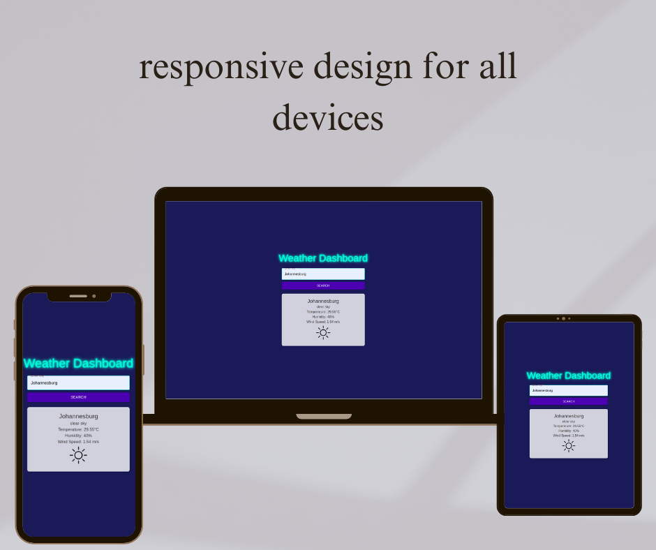

# Weather Dashboard ☁️🌤️🌧️

This is a simple and morden weather dashboard built using **React** , **Material-UI**, and the **OpenWeather API**.The dashboard allows users to search for weather conditions in any city around the world, displaying relevant weather data along with appropriate icons for different weather conditions. I made this app as a simple way to practice fetching data from an API and building intuitive user interfaces that are also interesting to look at.

## Features

- **Search functionality:** Enter any city to get real-time weather data.

- **Weather conditions:** Displays weather details like, temparature, humidity, wind speed, and weather description.

- **Dynamic icons:** Show relevant weather icons based on current weather conditions (sun, rain, clouds, snow).

- **Responsive design:** The app is fully responsive and works well on both desktop and mobile devices.

- **Frontend design:** Uses a dark blue background with neon text for a modern, high-contrast design.

## Technologies Used

- **React:** JavaScript library for building user interfaces.

- **Material-UI(MUI):** A popular React UI framework for designing components.

- **Material-UI(MUI):** A popular React UI framework for designing components.

- **OpenWeather API:** A weather data provider to get real-time weather information based on user input.

- **TypeScript:** For better type safety and development experience.

## Getting Started

### Prerequisites

Before you begin, make sure you have the following installed on your machine:

- **Node.js** (v12 or later)

- **npm**(Node package manager)

### Installation

1. Clone repository to local machine:

```
git clone https://github.com/yourusername/weather-dashboard.git
cd weather-dashboard
```

2. Install the required dependencies:

```
npm install
```

3. Create an .env file in the root directory and add your OpenWeather API key:

```
REACT_APP_WEATHER_API_KEY=put_your_api_key_here_immediately _after_equals_sign
```

4. Start the development server:

```
npm start
```

## Usage

1. **Search for weather:** type the name of any city in the input field and press "Search".

2. **Weather details:** The dashboard will display the current temperature, humidity, wind speed, and description of the weather.

3. **Weather icons:** Depending on the weather condition (e.g., clear, rain, snow), a corresponding icon will be displayed.

## App Demo

### Images



### Videos

Watch the demo of the Weather Dashboard in action:

[Watch Demo on YouTube](https://www.youtube.com/watch?v=kPkgpCbB5EU)
